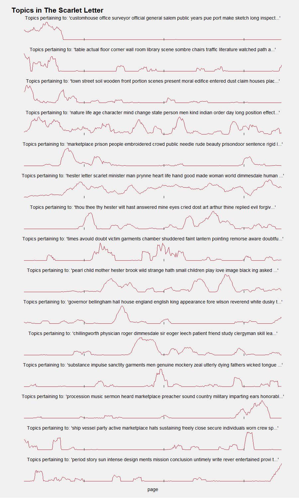

HTRC Book Models
----------------

Within-book topic modeling on HTRC feature extraction files.

This is an early release. If you are interested in trying it for yourself, please email me organisciak+htrc@gmail.com.

## Requirements

- Linux, Mac OS, or Windows with Cygwin installed
- [HTRC Feature Reader library](https://github.com/organisciak/htrc-feature-reader)
- Mallet 2.0.7

## Step-by-step: building and visualizing a book model

### Summary

    $ rsync -v sandbox.htrc.illinois.edu::ngpd-features/*/*t75t3gh25.json.bz2 texts/
    $ python save_for_mallet.py texts/uc2.ark+\=13960\=t75t3gh25.json.bz2
    $ ./train-infer-mallet.sh ThescarletletterByNathanielHawthorne 15
    $ Rscript graph-topics.r "The Scarlet Letter" images/scarlet.png

### 1. Download a book from the htrc feature extraction dataset

Since the current feature extraction dataset (Oct 2014) is built on the Hathitrust's non-Google-digitized public domain works, the basis of the Hathitrust Research Center's sandbox system, you can find books to visualize by using the [sandbox system's search engine](https://sandbox.htrc.illinois.edu/blacklight).

This time, let's find Nathaniel Hawthorne's _The Scarlet Letter_. There are a few copies, but [this one should do fine](https://sandbox.htrc.illinois.edu/blacklight/catalog/uc2.ark:/13960/t75t3gh25).

The HTRC feature extraction dataset gives you page-level feature information for 250k works, such as part-of-speech tagged term counts. It can be downloaded as as large export or, through rsync, individual files can be downloaded. We can make use of the latter approach to download just the features for Scarlet Letter.

On our search page, we see that the Volume ID is "uc2.ark:/13960/t75t3gh25". We can find the matching file with the last string, t75t3gh25.

    $ rsync -v sandbox.htrc.illinois.edu::ngpd-features/*/*t75t3gh25.json.bz2 texts/

### 2. Prepare document to for topic modeling

We'll be using Mallet for topic modeling using LDA, training models from individual pages and then inferring topics for a sliding scale of pages. To do so, the Feature pages need to be processed into a form that Mallet can read. This is done using a python script, save_for_mallet.py.

    usage: save_for_mallet.py [-h] [-f FRAME_SIZE] [-o OUTPATH] input

This script uses the [HTRC Feature Reader library](https://github.com/organisciak/htrc-feature-reader). Let's process the Scarlet Letter:

    $ python save_for_mallet.py texts/uc2.ark+\=13960\=t75t3gh25.json.bz2

Now, there are two files in `tmp/`: `train-ThescarletletterByNathanielHawthorne.txt` and `infer-ThescarletletterByNathanielHawthorne.txt`.
 
### 3. Build topic model, then inference against sliding frame

A shell script does all the hard work with Mallet.

    Usage: ./train-infer-mallet.sh NAME NUMTOPICS

Here, NAME is the string used in the temoprary files from the previous step (`/tmp/train-{{NAME}}.txt`).
You may want to edit the script for further Mallet customizations. The script have a high number of iterations specified, if it is too slow you can reduce this. You may also need to change the reference to the home Mallet directory, if it is not `mallet-2.0.7/` as the script assumes.

    $ ./train-infer-mallet.sh ThescarletletterByNathanielHawthorne 15

Inferred topics are saved to `tmp/inferred-pageframe-topics.txt`.  

### 4. Visualize topics

Visualization is done through R. On the command line, you can supply a work name, for the chart title, and an output path. You'll be alerted if any libraries are missing; all the dependencies are available through CRAN.

    $ Rscript graph-topics.r "The Scarlet Letter" images/scarlet.png
